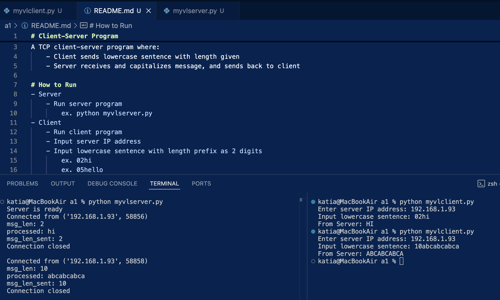

# Client-Server Program

A TCP client-server program where:
    - Client sends lowercase sentence with length given
    - Server receives and capitalizes message, and sends back to client

# How to Run
- Server
    - Run server program
        ex. python myvlserver.py
- Client
    - Run client program
    - Input server IP address
    - Input lowercase sentence with length prefix as 2 digits
        ex. 02hi
        ex. 05hello

