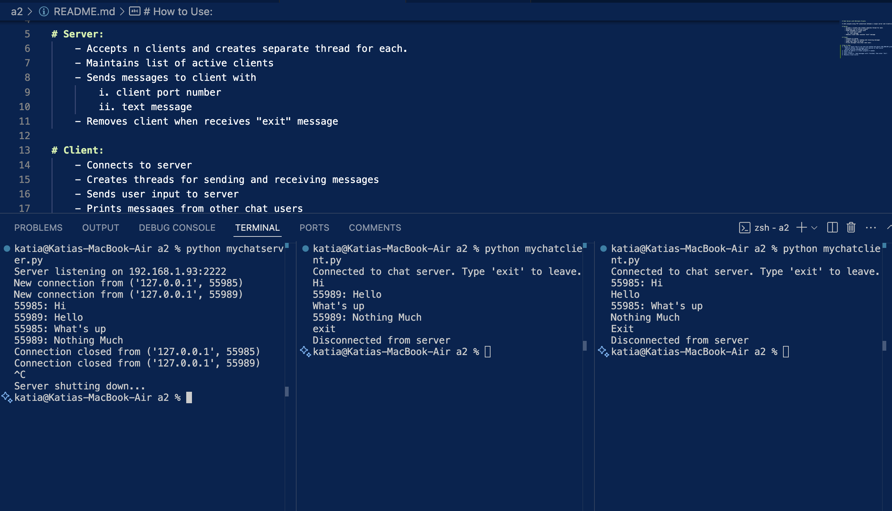

# Chat Server with Multiple Clients

A chat program using TCP connections between a single server and client(s). 

# Server:
    - Accepts n clients and creates separate thread for each. 
    - Maintains list of active clients
    - Sends messages to client with
        i. client port number
        ii. text message
    - Removes client when receives "exit" message

# Client:
    - Connects to server
    - Creates threads for sending and receiving messages
    - Sends user input to server
    - Prints messages from other chat users

# How to Use:
1. Choose if would like to use new-line method and adjust USE_NEWLINE global variable
    (Newline method: End messages with newline so that server
    ensures accurate message delievery)
2. Adjust IP address in client program if needed.
3. Start server.
4. Start client(s). Send messages until finished, then enter 'Exit'.
5. Manually close server.

