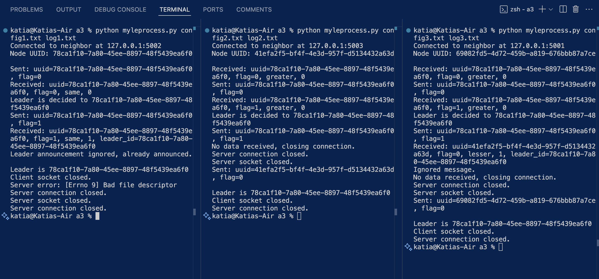

a3: The Leader Election Problem

# Description:
This program acts as a client and server. It creates a singular node that participates and communicates in an asynchronous ring. It implements a leader election leader algorithm that utilizes the Universally Unique Identifier (UUID). Messages are exchanged through the ring until a leader is declared and the election process ends. Each message is logged in a separate text file.

# How to Use:
1. Properly set up configuration file:
    Your_IP,Your_Port
    Neighbor_IP,Neighbor_Port
2. Run multiple instances of myleprocess.py.
    Make sure that each instance is using a properly modified configuration file so that it is assigned and connected to the correct port number. It will not work if the same configuration file is used for each process.

# Example Program Execution
